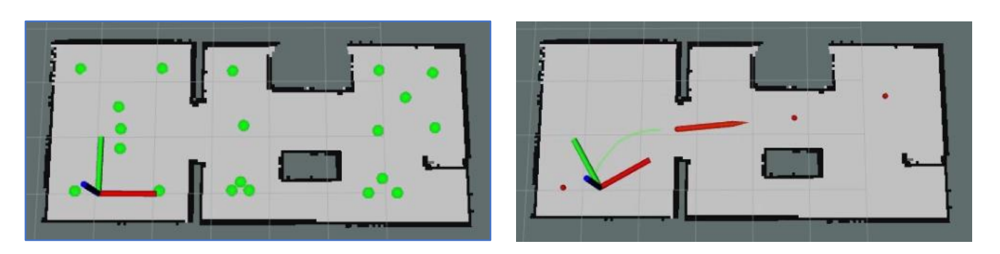

# Topological Navigation with ROS

This repository contains a project for implementing topological navigation in ROS. Using preprocessed maps and the Dijkstra algorithm, this project enables a mobile robot to navigate through various regions, moving from a start node to a target node efficiently by following the shortest path.

## Overview

This navigation system uses topological maps, generated from an initial environment exploration, where:
1. **Nodes and Subnodes**: Key points are identified in the map, creating a simplified network of connection points.
2. **Graph Construction**: The nodes are connected to form a coherent graph, with NetworkX library ensuring efficient structure.
3. **Path Planning**: Dijkstra’s algorithm is used to find the optimal path from the robot’s current location to the desired target node.

## Key Components

- **Map Preprocessing**: The map is segmented into regions, with nodes identified using Voronoi diagrams and Watershed segmentation to define connection points.
- **Graph-based Path Planning**: NetworkX constructs a graph where each node is connected to its nearest neighbors, creating a navigable structure.
- **Dijkstra Algorithm**: Calculates the shortest path between nodes, which is then used to guide the robot along the route.

## Dependencies

- **ROS1**: Robot Operating System (tested on ROS Melodic).
- **Gazebo**: Simulation environment for robot navigation.
- **RViz**: Visualization tool for monitoring exploration progress.
- **move_base**: Enables autonomous navigation.
- **map_server**: For loading and managing map data.
- **amcl**: Adaptive Monte Carlo Localization for robot positioning.
- **sensor_msgs** and **geometry_msgs**: Required for sensor data and geometry message types.
- **actionlib**: For asynchronous task management.
- **tf**: Manages coordinate frame transformations.
- **costmap_2d** (optional): Adds cost mapping for enhanced navigation.
  

